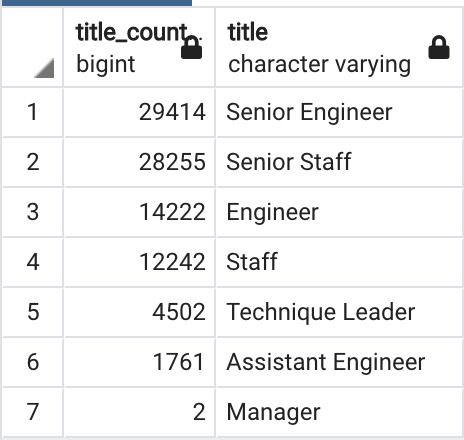

# HP-analysis

## Overview of Project and Purpose
The purpose of this project is to utilize Postgre in order to create a datbase of fake HP employee information, and then query tables within the database to pull information about retirement eligible employees.

Specifically, looking at those that are retirement elgible based on their birth date to determine the positions, departments, and total 

## Analysis Results
### Deliverable 1: Retiring Ttiles
 
- There are seven main job titles of which employees are retirement eligible, with the majority of them being in positions Senior Engineer and Senior Staff.
- Four of the seven job titles are of higher level, being that they are "Senior", "Leader", or "Manager". These positions can be hard to fill, as they require more honed skills and/or seasoned experience. Therefore, a mentorship program would be of great benefit in assisting those in these lower level position, become ready to fill these higher level positions upon mass retirement. 

### Deliverable 2: Employee Eligible for Mentorship Program
 
- something here
- something here

## Summary
Provide high-level responses to the following questions, then provide two additional queries or tables that may provide more insight into the upcoming "silver tsunami."
How many roles will need to be filled as the "silver tsunami" begins to make an impact? 
Are there enough qualified, retirement-ready employees in the departments to mentor the next generation of Pewlett Hackard employees?

