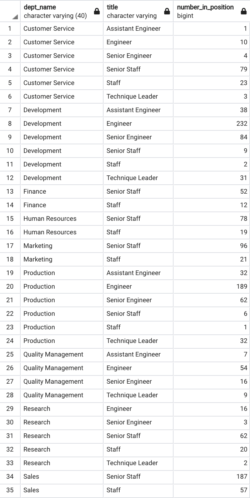

# HP-analysis

## Overview of Project and Purpose
The purpose of this project is to utilize Postgresql in order to create a datbase, tables, and import fake HP Employee data in order to conduct an analysis on upcoming retirements within the organization (deemed the "Silver Tsunami"). 

This database had employee information such as title, department, hire date, and birthdate. There are currently 240,124 active employees of which 90,398 are eligible to retire based on their birthdate between January 1, 1952 and December 31, 1955. This means the HP workforce has 37.64% of their employee eligible for retirement. From here we dive into an analysis to assist with workforce planning, to see what titles these eligible retirees will be vacating, as well as what kind of mentorship program can be implemented in order to "groom" lower level employees to take over these vacancies. 

When looking at positions that will need to be filled, due to employees leaving from retirement, there is a 15% assumed attrition rate. Meaning that 15% of vacated positions will not be backfilled with either a new hire or internal employee, it will be closed. Most companies that have mass retirement waves allow for natural attrition in order to cut costs and reduce unnecessary positions. 

## Analysis Results
### Deliverable 1: Retiring Ttiles & Eligible Backfills
 
- There are seven main job titles of which employees are retirement eligible, with the majority of them being in positions Senior Engineer and Senior Staff.
- Four of the seven job titles are of higher level, being that they are "Senior", "Leader", or "Manager". These positions can be hard to fill, as they require more honed skills and/or seasoned experience. Therefore, a mentorship program would be of great benefit in assisting those in these lower level position, to become ready to fill these higher level positions upon mass retirement. 

 
When looking at the number of employees (not eligible for retirement) that are currently in lower level positions that progress up to higher level positions which will be vacated due to retirements, in some cases there is a defecit and external hiring will need to be done. However, in cases where there is a surplus of lower level employees, there is an opportunity to develop a mentorship program, to allow for upcoming retirees to mentor and teach lower level employees to fill their position upon leaving.
- For a majority of the positions across the department, there is a deficit and external hiring will need to be done in order to fill remaining positions needing to be filled. Or, there could be a possibility of internal transfers across departments of similar positions, when there is a surplus (ex: Senior Engineers in Development Department). 
- For 8 positions across various departments, there is a surplus which allows for an opportunity for mentorship, to groom lower level employees to promote into higher level positions upon vacancy. 

### Deliverable 2: Employee Eligible for Mentorship Program
 
- Looking at those with a birthdate in the year 1965 as those who could be eligible to be a mentor, the number of people eligible to be a mentor isn't sufficient enough for the amount of positions that need to be filled by those retiring. Even if just looking at titles, and excluding the department requirement, there isn't enough mentors to help grow the lower level employees for the number of higher level positions vacated.

 
- However, if we broaden the birthdate range from January 1, 1952 to December 31, 1965, which includes those that are elgible for retirement, the amount of mentors available is exceptional, and well above what is needed to train the workforce for taking over as retirees leave.

## Summary
The HP workforce is facing a large population change, with 37% of their workforce eligible for retirement. 

